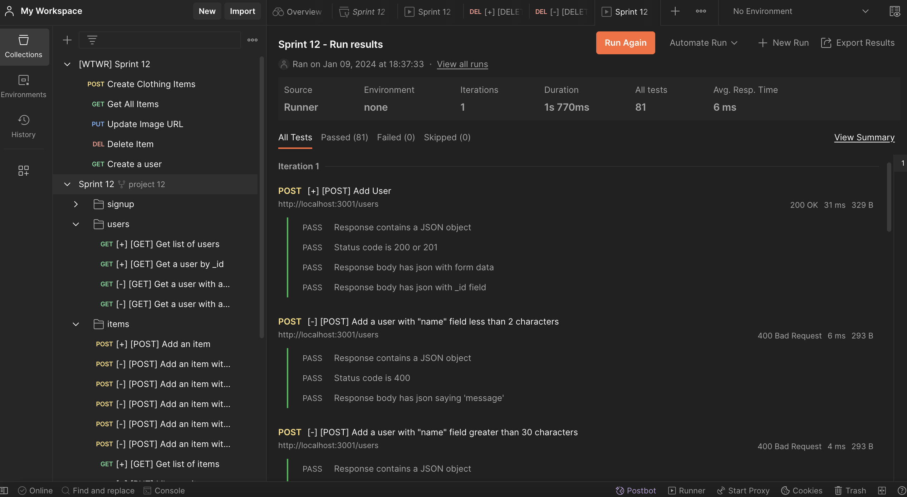
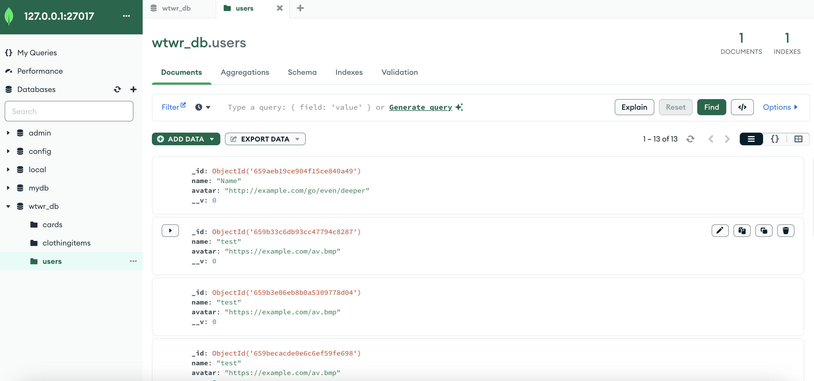

# WTWR (What to Wear?) : Back End

## Overview

- About the project
- Features
- Technologies used
- Links
- Images of Requests and Demo Server

## About the project

The project is the backend of the WTWR project. Routes and Controllers are used to fetch, create, and delete items on the front end. In this project, security and testing is set up to authorizes and store user data safely in the remote server.

## Features

- Database created and connected to remote server
- Configured routes and controllers for desired API connection
- Error Handling
- Validations for URL fields
- Implemented authorization solution

## Technologies Used

- Node.js
- Express framework
- MongoDB database
- Mongoose ODM
- Postman

## Links

- The project is hosted on GitHub Pages and can be seen live using the this [https://sheenasli.github.io/se_project_react]
- The project's backend can be found by using this [https://github.com/sheenasli/se_project_react]

## Images of Requests and Demo Server

